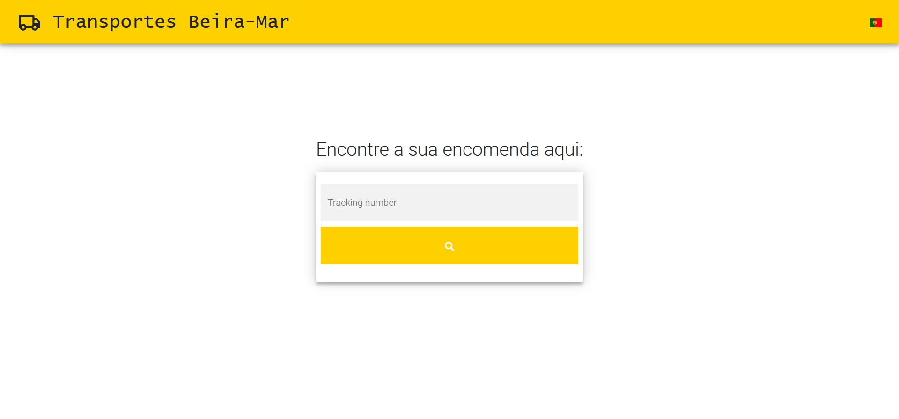
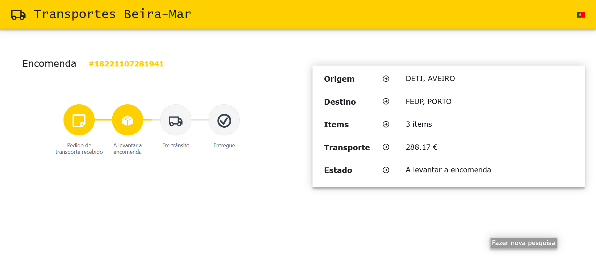

In this project, within the scope of the Services Engineering and Management course, it was intended to develop a micro-service and deploy it in a Kubernetes network.

The micro-service developed consists of a platform for managing orders placed through a specific transport company.

The microservice's REST API was developed with FastAPI using a MongoDB database. Its documentation can be consulted here:
https://app.swaggerhub.com/apis-docs/guilhermecsousa/Transportes_BeiraMar/0.1.0

The frontend was developed in React and the web page looks like this:

  

  

Each module has a Dockerfile in its folder and the deployment files can be found in the k8s folder.
